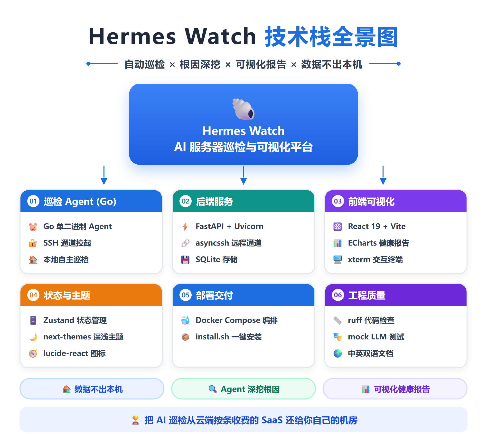
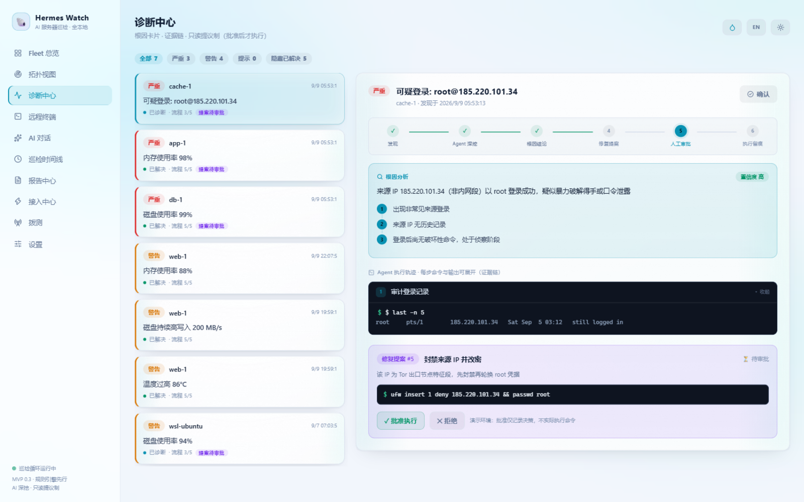
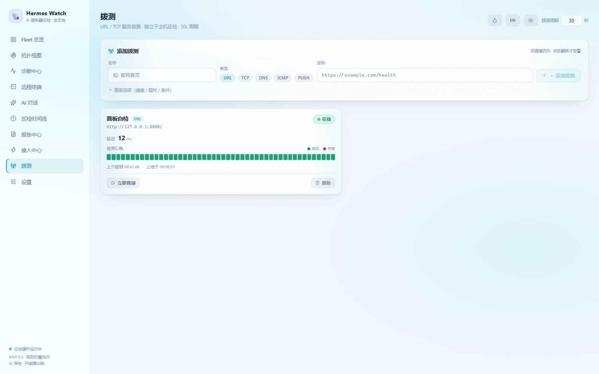
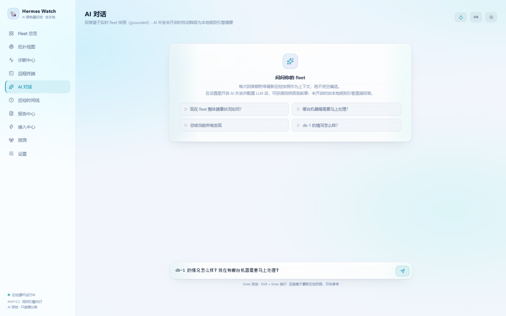
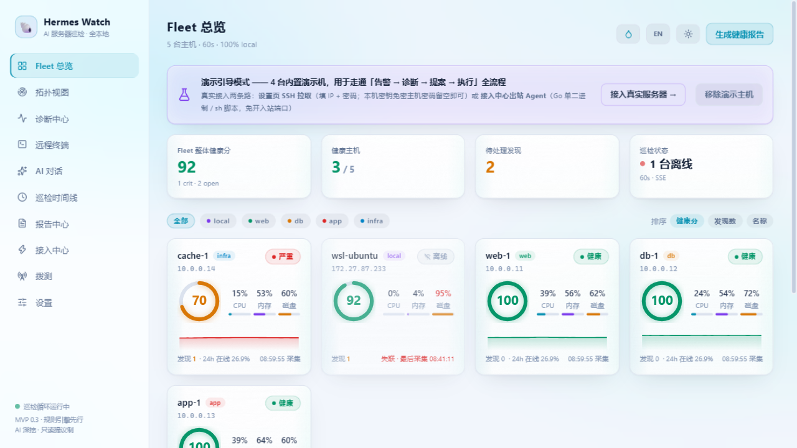
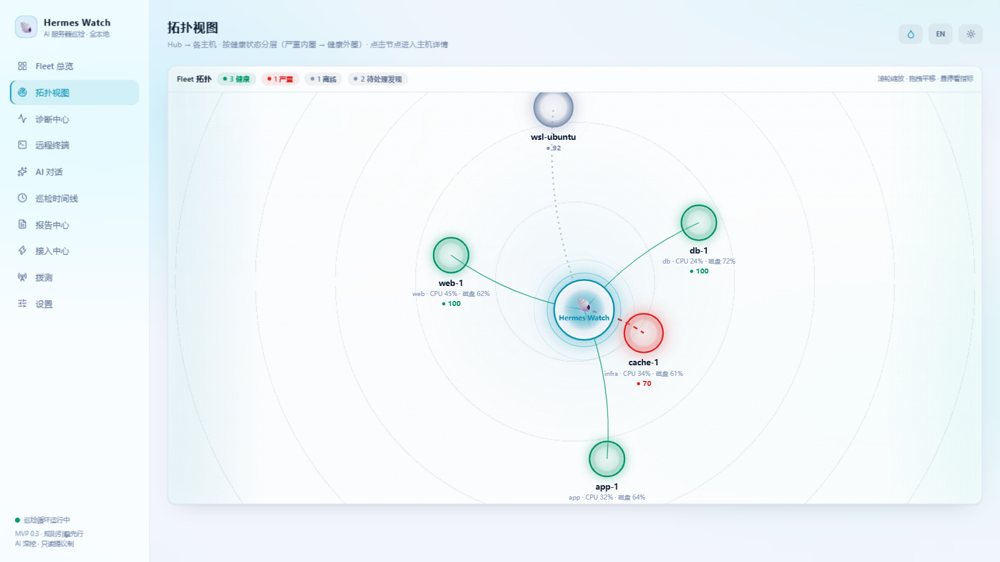
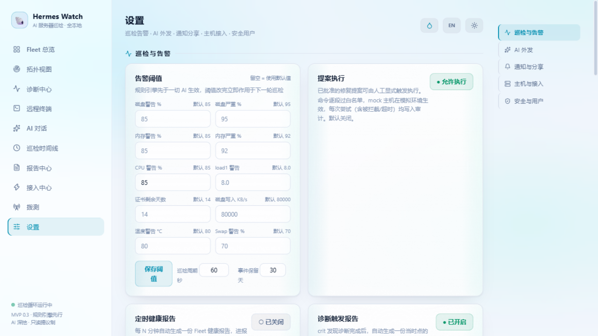

# Hermes Watch 🐚




> AI 服务器巡检与可视化平台 · 把 AI 巡检还给你自己的机房

[English](README_EN.md) · 中文

**一句话**：Grafana/Netdata 把 AI 锁在云里按条收费，Hermes Watch 让一个懂运维的 agent 住进你自己的机器——自动巡检本地和云服务器、深挖根因、出可视化健康报告，全程数据不出本机。

## 界面一览


| 诊断中心（根因卡 + 证据链 + 提案审批） | 拨测（URL/TCP/DNS/ICMP/Push） | AI 对话（思考链/工具调用折叠展示） |
|---|---|---|
|  |  |  |

## 📸 界面截图

| Fleet 总览 | 主机拓扑 | 设置中心 |
|-----------|----------|---------|
|  |  |  |

## 架构

```
浏览器 (React + ECharts + xterm.js, :5273)
   │ /api 代理 · /ws WebSocket
后端 (FastAPI + SQLite, :8800)
   ├─ 采集层   SSH 只读探测（asyncssh，并发限流）/ 内置演示模拟器（实时行走曲线）
   │           出站 Agent（beszel 式：目标机 sh+curl 主动 push，免入站端口）
   │           在线判定：3 个巡检周期无成功采集 → 主机标记离线（Fleet/拓扑可视化）
   ├─ 拨测     URL / TCP / DNS / Push 四类服务拨测（独立周期，Gatus 式双阈值防抖：
   │           连续 N 次失败才下线 / 连续 N 次成功才恢复）→ 心跳条带图 + 翻转才告警
   ├─ 规则引擎  确定性阈值规则（阈值 + 滞后恢复线，可在设置页调整）→ 发现 + 健康分
   ├─ 告警生命周期  自动恢复（连续 3 轮未再触发 → resolved + 恢复通知带持续时长）
   │           crit 持续告警周期重发 · 免打扰时段（跨午夜）· 多渠道通知（模板可自定义）
   ├─ 分析引擎  按发现类型深挖（du/ps/last/systemctl）→ 根因卡 + 证据链
   │           （可选：OpenAI 兼容 LLM 叙事，默认关，BYO；AI 只补充视角，不覆盖规则结论，backend/mock_llm.py 提供本地试运行端点）
   ├─ AI 对话  聊天式问答：LLM 自动调用只读工具查实时数据（fleet/发现/指标/拨测/事件）再回答，
   │           思考链与工具调用折叠展示；LLM 关闭降级本地规则引擎摘要
   ├─ 提案审批  修复动作 = 卡片，批准才执行，全审计（只读提议制）
   ├─ 远程终端  WebSocket → asyncssh PTY（演示主机为模拟 shell）
   ├─ 本地 MCP  只读 streamable-HTTP 端点（8 工具），Claude/Cursor 直查巡检数据
   └─ 报告引擎  结构化数据 → 本地 HTML 健康报告（支持定时自动生成）
```

## 快速开始

**Linux / macOS 一键安装**（装依赖 + 构建前端 + 可选 systemd 开机自启）：

```bash
git clone https://github.com/StarrySea1412/hermes-watch.git && cd hermes-watch
./install.sh                 # 或 sudo ./install.sh --systemd
./install.sh --update        # 以后升级：拉代码 + 重构 + 重启服务
```

**Windows 手动安装**：

```powershell
# 后端（Windows，Python 3.11+）
cd backend
py -3.11 -m venv venv
./venv/Scripts/python -m pip install fastapi "uvicorn[standard]" asyncssh httpx
./venv/Scripts/python run.py        # http://127.0.0.1:8800

# 前端
cd frontend
npm install
npm run dev                          # http://localhost:5273
```

**生产模式（单进程）**：`cd frontend && npm run build`，后端自动托管 `frontend/dist`——重启后端后直接访问 `http://127.0.0.1:8800` 即是完整面板（SPA 路由/静态资源/PWA 全部就绪），无需第二个进程。**Docker**：`docker build -t hermes-watch . && docker run -p 8800:8800 -v hermes-data:/data hermes-watch`（数据与密钥持久化在 `/data` 卷，`HW_DATA_DIR` 可重定向；每日自动备份到 `backups/`，设置页可手动备份/恢复）。CI：GitHub Actions 每次 push 自动跑 200+ 项回归（后端）+ 25 项组件测试（前端）+ agent 三平台编译检查；打 `v*` tag 自动发布 agent 二进制到 Release。

首次启动自动播种 4 台演示主机（web-1 健康 / db-1 磁盘填满 / app-1 内存泄漏 / cache-1 可疑登录），并自动触发诊断。

## 演示故事线（3 分钟）

1. 打开 `Fleet 总览`：db-1/app-1/cache-1 卡片告警，事件流实时滚动
2. 打开 `诊断中心`：每条发现的根因卡 → 展开 Agent 执行轨迹（命令+输出）→ 修复提案
3. 点 `✓ 批准执行`（仅记录决策）→ 提案变已批准 → 点 `▶ 现在执行`：逐段白名单校验，mock 主机在模拟环境真实生效（指标曲线回落、chaos 解除），每次尝试留执行审计
4. `报告中心` 生成/查看 Fleet 健康报告
5. `设置` 里可添加真实 SSH 主机（填 IP + 凭据，下一轮巡检自动采集）；`提案执行` 开关默认关闭

## 界面主题：日 / 夜双模式

- 右上角 🌙 按钮循环切换 **夜间 → 日间 → 跟随系统**（next-themes），偏好存本地，刷新无闪烁
- 全站两套设计 token：夜间「深海观测站」/ 日间「白昼灯塔」，组件与图表全部走 CSS 变量
- ECharts 图表随主题实时取色重绘（拓扑视图、指标曲线等）
- 终端画面刻意保持深色（更像真实终端），页面框架随主题变化
- 定时生成的 HTML 健康报告同样适配系统明暗偏好（prefers-color-scheme）

## 接入真实服务器

- **出站 Agent（推荐）**：接入中心页生成 Token → 目标机运行 [Go 单二进制](agent-go/README.md)（HMAC 签名防重放，上报进程/失败服务/证书），或下载 `hermes-watch-agent.sh`（sh + curl，纯只读）。机器在内网/防火墙后无需开入站端口，指标每 60s 主动推送
- **SSH 拉取**：设置页填 `名称/IP/用户/密码`，巡检走 SSH 只读探测（top/free/df/ps/systemctl/last/openssl）
- **服务拨测**：拨测页添加 URL（`https://…/health`）或 TCP（`host:port`）目标，周期自动拨测（全局 30s，可每目标独立）；Gatus 式条件引擎：状态码 + **关键词包含** + **响应时间上限** + **HTTPS 证书剩余天数**，双阈值防抖（默认连续 3 次失败下线 / 2 次成功恢复），下线/恢复事件进时间线并外发通知，48 桶心跳条带图看历史
- **Docker 演示 fleet**：`cp .env.example .env` 填入公钥 → `docker compose up -d`（2221-2223 端口）
- **故障注入**：`./chaos.sh disk demo-db-1` 观察告警→诊断→提案全链路
- **WSL 当服务器（已实战验证）**：`sudo apt install openssh-server && systemctl enable --now ssh`，把 WSL IP（`hostname -I`）添加进面板。密码留空 = 自动使用本机 `~/.ssh/id_ed25519` 密钥免密登录（公钥需在目标机 `authorized_keys` 中）。注意：WSL2 空闲约 60s 会回收整个 VM，sshd 随之消失——保持 WSL 终端开着，或在 `%UserProfile%\.wslconfig` 配 `[wsl2] vmIdleTimeout=-1`
- **接入任意 LLM**：MCP 客户端（Claude Desktop / Cursor）配置 `http://127.0.0.1:8800/api/mcp`，8 个只读工具直查巡检数据；面板 AI 对话页同样由 LLM 自动调用这套只读工具（思考链/工具调用折叠展示）；LLM 调用链路详解见 [`docs/LLM.md`](docs/LLM.md)
- **告警通知**：设置 → 通知渠道，10 渠道：企业微信 / 钉钉 / 飞书 / Telegram / Server酱 / 通用 Webhook / Discord / Slack / ntfy / SMTP 邮件（Shoutrrr 式单字段配置）；crit 告警推送、恢复通知（带持续时长）、持续告警周期重发、免打扰时段，发送前可一键测试
- **本地试 AI 叙事（无需真实 LLM）**：`py backend/mock_llm.py`（内置本地 mock 端点 :18777）→ 设置页 Base URL 填 `http://127.0.0.1:18777/v1`，开启 AI 外发后重新诊断即可看到「AI 叙事」区块

## 与全家桶 AIOps 的对比

赛道里出现了把 Prometheus+Loki+Tempo+Grafana 全家桶打包装进 AI Ops 重量级玩家（Ongrid、Aurora、Keep）。
Hermes Watch 走的是另一头：**单文件 SQLite、无消息队列、2GB 内存盒子可跑**——

| | Hermes Watch | 全家桶 AIOps |
|---|---|---|
| 部署面 | 单进程 + SQLite，`install.sh` 一条命令 | 内置时序库/日志/链路追踪/图数据库多组件 |
| 内存 | 数百 MB | GB 级 |
| AI 能力 | 规则引擎先行 + 工具循环对话 + 提案审批执行 | 专科 agent + RAG（更深，也更重） |
| 适合 | 个人/小团队的自有机房、NAS、边缘盒子 | 有专职 SRE 团队的中大型集群 |

选型建议：想要「机器上多一个常驻观测员」选我们；想要「重建一套观测平台再配 AI」选全家桶。

## 设计铁律（来自竞品调研，见 `docs/`）

1. 规则引擎先出事实，AI 只串叙事 + 深挖（不拿 LLM 做实时检测）
2. 每条 AI 结论必须带证据链，可回跳命令输出
3. 提议制不变：agent 永不直接改机器。批准仅记录决策；执行是批准后的独立显式动作——逐段白名单校验（正则全匹配，`rm -rf`、管道注入直接拦截）、20s 超时、每次尝试（含被拦截/超时）写入 proposal_runs 审计表，开关默认关闭
4. AI 外发默认关闭（Termix 式 gating），开启前数据不出本机
5. 部署极轻：单文件 SQLite，无消息队列/全家桶

## License

Apache-2.0（见 [LICENSE](LICENSE)）。
